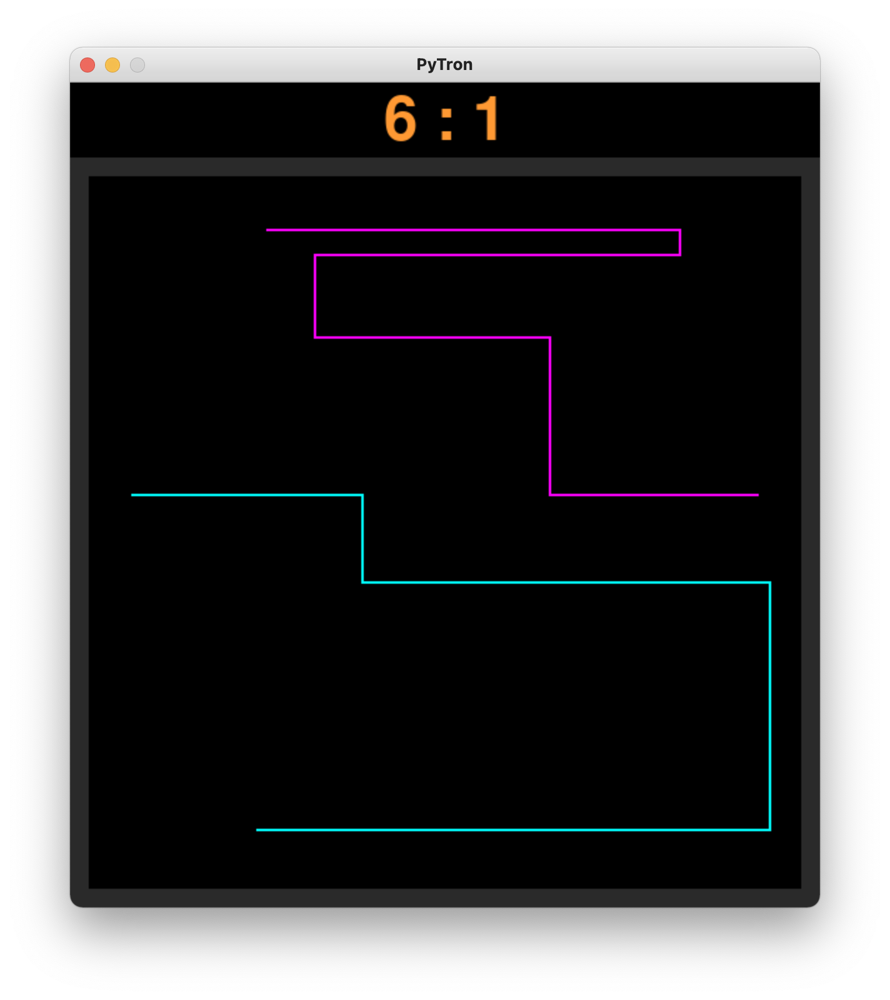

# Description
This program generates a 2-player Tron game.  Controls for player 1 are W,A,S,D for directions and LSHIFT for boost.  COntrols for player 2 are UP,LEFT,DOWN,RIGHT for directions and RSHIFT for boost.

# Execution
`python3 -u path/to/file/lib.py`

You will need to install pygame to run the program properly \
`pip install pygame`

# Useful Sites

https://www.pygame.org/wiki/tutorials
